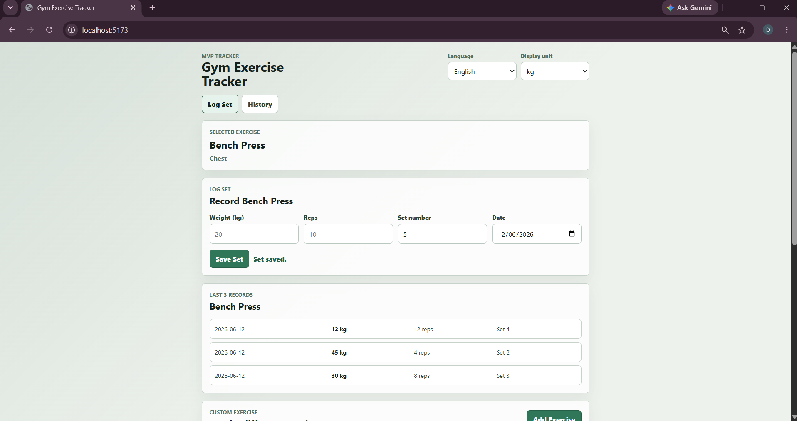

# Gym Exercise Tracker

Gym Exercise Tracker adalah web app untuk pengguna gym pemula sampai menengah yang ingin mencatat latihan mandiri secara cepat dari browser. Aplikasi tidak memakai backend; exercise custom, catatan set, dan preferensi pengguna disimpan di browser melalui `localStorage`.

## Fitur yang Diimplementasikan

- Katalog exercise default berdasarkan muscle group.
- Search dan filter exercise.
- Tambah exercise custom.
- Catat set dengan beban kg, reps, nomor set, dan tanggal.
- Lihat 3 catatan terakhir untuk exercise aktif.
- Riwayat per exercise dengan filter 7 hari, 30 hari, dan semua data.
- Edit dan hapus catatan set dengan konfirmasi.
- Preferensi tampilan kg/lbs dan English/Indonesia.
- Persistensi data lokal setelah browser di-refresh.

## Tech Stack

- React
- Vite
- Vitest
- JavaScript
- CSS
- Browser `localStorage`

## Instruksi Instalasi

```powershell
npm install
```

## Menjalankan Aplikasi

```powershell
npm run dev
```

Buka URL yang ditampilkan Vite, biasanya:

```text
http://127.0.0.1:5173
```

## Penggunaan

1. Pilih exercise dari katalog default.
2. Gunakan search atau filter muscle group untuk menemukan exercise.
3. Tambahkan exercise custom jika exercise belum tersedia.
4. Isi weight, reps, set number, dan date, lalu pilih `Save Set`.
5. Buka tab `History` untuk melihat riwayat exercise aktif.
6. Gunakan filter `7 days`, `30 days`, atau `All`.
7. Gunakan tombol `Edit` atau `Delete` pada riwayat untuk memperbaiki data.
8. Ubah `Language` dan `Display unit` dari header.
9. Refresh browser untuk memastikan data dan preferensi tetap tersimpan.

## Testing dan Build

```powershell
npm test
npm run build
```

## Screenshots

Evidence browser dan testing tersedia di folder `assets/screenshots/`:

- Aplikasi berjalan: `assets/screenshots/browser-app-running.png`
- Mobile viewport: `assets/screenshots/mobile-viewport.png`
- Chrome DevTools Console: `assets/screenshots/devtools-console.png`
- Passing test: `assets/screenshots/passing-tests.png`
- Failing test: `assets/screenshots/failing-test.png`

Contoh tampilan aplikasi:



## Known Limitations

- Data hanya tersimpan di browser lokal dan dapat hilang jika pengguna menghapus data browser.
- Tidak ada login, akun pengguna, backend, database server, atau sinkronisasi antarperangkat.
- Aplikasi belum menyediakan export/import data untuk backup.
- Aplikasi belum menyediakan program latihan otomatis, grafik progres, atau analitik lanjutan.
- Pada mobile viewport, area riwayat dapat memiliki horizontal scroll lokal saat tombol Edit/Delete terlihat. Kontrol tetap dapat dijangkau dan digunakan.

## Pull Request dan Delivery

Branch fitur untuk penyelesaian MVP:

```text
feature/mvp-remaining-issues
```

Target PR:

```text
development
```

Contoh deskripsi PR:

```text
Complete MVP vertical slices for Gym Exercise Tracker.

Closes #2
Closes #3
Closes #4
Closes #5
Closes #6
Closes #7
```

Jika nomor GitHub Issue berbeda dari dokumen lokal, sesuaikan `Closes #...` dengan issue sebenarnya.

Catatan: PR final dari `development` ke `master` perlu mencantumkan kembali `Closes #2` sampai `Closes #7` agar GitHub menutup issue otomatis, karena default branch repository adalah `master`.
