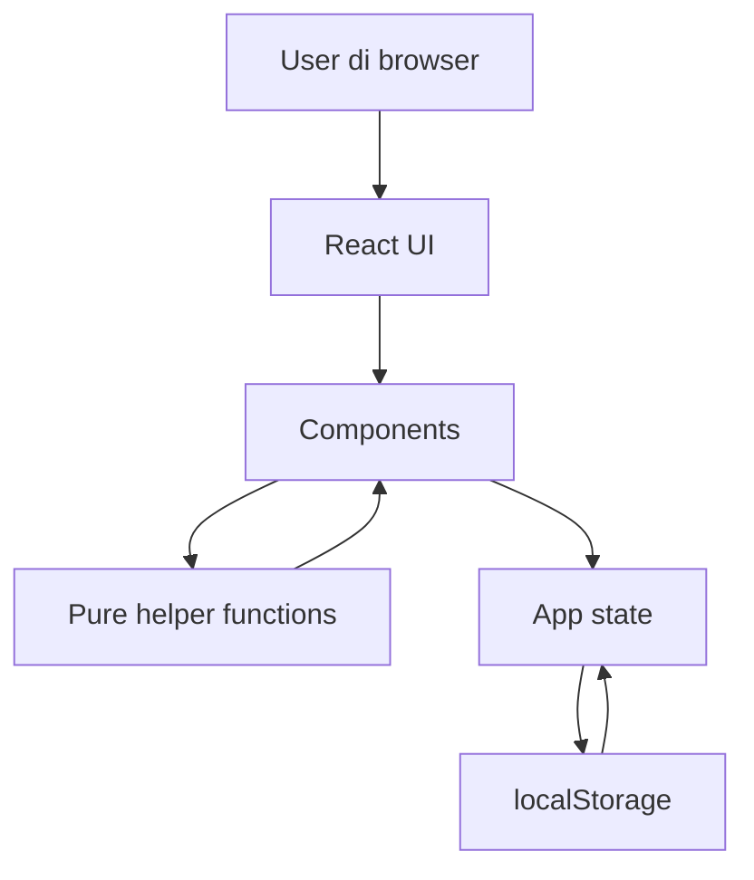

# Design - Gym Exercise Tracker

## Ringkasan Desain

Gym Exercise Tracker akan dibuat sebagai web app React + Vite yang berjalan sepenuhnya di browser. Tidak ada backend, login, API server, atau database eksternal. Semua data latihan, exercise custom, dan preferensi user disimpan di local browser storage.

Target implementasi adalah sekitar 4 jam coding, jadi desain sengaja dibuat kecil dan praktis. Fokus utama adalah alur pengguna yang bisa didemokan: pilih exercise, catat set, lihat 3 catatan terakhir, buka riwayat per exercise, edit/hapus data, ganti satuan, ganti bahasa, lalu refresh browser untuk membuktikan data tetap ada.

## Sketsa UI / Wireframe

### Mobile-first layout

```text
+------------------------------------------------+
| Gym Exercise Tracker        [EN/ID] [kg/lbs]   |
+------------------------------------------------+
| Tabs: [Log Set] [History]                      |
+------------------------------------------------+
| Search exercise                                |
| [____________________________]                 |
| Muscle group filter                            |
| [All v]                                        |
+------------------------------------------------+
| Exercise list                                  |
| > Bench Press        Chest                     |
|   Lat Pulldown       Back                      |
|   Squat              Legs                      |
| [+ Add Exercise]                               |
+------------------------------------------------+
| Selected: Bench Press                          |
| Weight (kg)  Reps  Set No.  Date               |
| [20       ] [10 ] [1     ] [2026-06-11]        |
| [Save Set]                                     |
+------------------------------------------------+
| Last 3 records                                 |
| 2026-06-11 | 20 kg | 10 reps | Set 1           |
| 2026-06-10 | 18 kg | 10 reps | Set 3           |
| 2026-06-10 | 18 kg | 8 reps  | Set 2           |
+------------------------------------------------+
```

### History view

```text
+------------------------------------------------+
| History: Bench Press                           |
| Filter: [7 days] [30 days] [All]               |
+------------------------------------------------+
| Highest weight: 25 kg      Total sets: 12      |
+------------------------------------------------+
| Date       Weight   Reps   Set   Actions       |
| 2026-06-11 20 kg    10     1     [Edit][Del]   |
| 2026-06-10 18 kg    10     3     [Edit][Del]   |
+------------------------------------------------+
```

## Alur Pengguna (User Flow)

1. User membuka aplikasi.
2. Aplikasi memuat data dari local storage atau memakai default state jika belum ada data.
3. User berada di tab `Log Set`.
4. User mencari exercise atau memfilter berdasarkan muscle group.
5. User memilih exercise dari daftar default atau menambahkan exercise custom.
6. Aplikasi menampilkan exercise aktif dan 3 catatan terakhir untuk exercise tersebut.
7. User mengisi beban, reps, nomor set, dan tanggal.
8. User menyimpan catatan set.
9. Aplikasi memvalidasi input, menyimpan data, dan memperbarui 3 catatan terakhir.
10. User membuka tab `History`.
11. User memilih filter `7 days`, `30 days`, atau `All`.
12. Aplikasi menampilkan daftar riwayat, beban tertinggi, dan total set untuk exercise aktif.
13. User dapat mengedit atau menghapus catatan dari riwayat.
14. User dapat mengganti bahasa dan satuan berat kapan saja.
15. Setelah browser di-refresh, data latihan dan preferensi tetap tersedia.

## Component Breakdown

- `App`
  - Menyimpan app state utama.
  - Menghubungkan storage, preferensi, bahasa, dan view aktif.
  - Mengatur tab `Log Set` dan `History`.

- `AppHeader`
  - Menampilkan nama aplikasi.
  - Menyediakan kontrol bahasa `English/Indonesia`.
  - Menyediakan kontrol satuan `kg/lbs`.

- `ExercisePicker`
  - Menampilkan search input.
  - Menampilkan filter muscle group.
  - Menampilkan daftar exercise default dan custom.
  - Mengirim exercise terpilih ke state utama.

- `AddExerciseForm`
  - Mengizinkan user menambahkan exercise custom.
  - Memvalidasi nama dan muscle group.
  - Menambahkan exercise baru ke state utama.

- `SetLogForm`
  - Form input beban, reps, nomor set, dan tanggal.
  - Memvalidasi input.
  - Menyimpan catatan set baru.

- `RecentRecords`
  - Menampilkan maksimal 3 catatan terakhir untuk exercise aktif.
  - Membantu user melihat beban/reps sebelumnya sebelum mencatat set baru.

- `HistoryView`
  - Menampilkan riwayat per exercise.
  - Menyediakan filter `7 days`, `30 days`, dan `All`.
  - Menampilkan ringkasan beban tertinggi dan total set.

- `SetRecordList`
  - Menampilkan daftar catatan pada history.
  - Menyediakan aksi edit dan delete.

- `EditSetModal`
  - Mengedit semua field catatan set.
  - Menggunakan validasi yang sama dengan `SetLogForm`.

- `ConfirmDialog`
  - Mengonfirmasi penghapusan catatan.

## Model Data

```ts
type MuscleGroup =
  | "Chest"
  | "Back"
  | "Shoulders"
  | "Arms"
  | "Core"
  | "Legs"
  | "Upper Body"
  | "Lower Body";

type Exercise = {
  id: string;
  name: string;
  muscleGroup: MuscleGroup;
  source: "default" | "custom";
};

type SetRecord = {
  id: string;
  exerciseId: string;
  weightKg: number;
  reps: number;
  setNumber: number;
  date: string; // YYYY-MM-DD
  createdAt: string; // ISO timestamp
  updatedAt: string; // ISO timestamp
};

type Preferences = {
  language: "en" | "id";
  weightUnit: "kg" | "lbs";
};

type AppState = {
  customExercises: Exercise[];
  setRecords: SetRecord[];
  preferences: Preferences;
};
```

### Validasi Data

- `weightKg` harus integer dan boleh `0`.
- `reps` harus integer positif.
- `setNumber` harus integer positif.
- `date` wajib ada dalam format tanggal.
- `exerciseId` wajib mengarah ke exercise default atau custom yang tersedia.
- `language` default adalah `en`.
- `weightUnit` default adalah `kg`.

## Desain API

Tidak ada network API pada MVP. "API" internal aplikasi berupa helper function murni agar mudah diuji dengan TDD.

```ts
validateSetInput(input): ValidationResult
createSetRecord(input, now): SetRecord
updateSetRecord(records, recordId, input): SetRecord[]
deleteSetRecord(records, recordId): SetRecord[]
filterExercises(exercises, query, muscleGroup): Exercise[]
getRecentRecords(records, exerciseId, limit): SetRecord[]
filterRecordsByPeriod(records, period, today): SetRecord[]
getHistorySummary(records): { highestWeightKg: number; totalSets: number }
formatWeight(weightKg, unit): string
loadAppState(): AppState
saveAppState(state): void
```

Helper di atas menjadi titik utama untuk unit test. UI akan memanggil helper tersebut, lalu render hasilnya.

## Struktur File / Modul

```text
src/
  main.jsx
  App.jsx
  data/
    defaultExercises.js
    translations.js
  components/
    AppHeader.jsx
    ExercisePicker.jsx
    AddExerciseForm.jsx
    SetLogForm.jsx
    RecentRecords.jsx
    HistoryView.jsx
    SetRecordList.jsx
    EditSetModal.jsx
    ConfirmDialog.jsx
  lib/
    exercise.js
    records.js
    storage.js
    units.js
    validation.js
  styles/
    index.css
tests/
  exercise.test.js
  records.test.js
  storage.test.js
  units.test.js
  validation.test.js
```

Struktur ini menjaga logika bisnis di `src/lib`, data statis di `src/data`, dan UI di `src/components`. Untuk proyek 4 jam, ini cukup rapi tanpa membuat arsitektur terlalu berat.

## Diagram Arsitektur



## Keputusan Technology Stack

- React + Vite dipilih karena cepat untuk membuat SPA kecil, form, list, dan state lokal.
- JavaScript dipilih untuk menjaga setup cepat dalam batas 4 jam. TypeScript ditunda agar waktu tidak habis untuk konfigurasi dan typing.
- Vitest direkomendasikan untuk unit test helper karena cocok dengan Vite dan cepat dijalankan.
- React Testing Library dapat dipakai untuk beberapa workflow penting jika waktu cukup.
- CSS biasa dipilih untuk MVP agar tidak menambah dependency UI framework.
- localStorage dipakai karena requirement hanya membutuhkan penyimpanan lokal browser.

## Trade-offs / Pertimbangan Penting

- Single-page app lebih cepat dibuat daripada routing penuh. Trade-off: URL tidak merepresentasikan view detail, tetapi cukup untuk MVP.
- State lokal di `App` lebih sederhana daripada state management library. Trade-off: jika fitur membesar, state bisa perlu dipisah.
- localStorage mudah dan cepat. Trade-off: data bisa hilang jika user clear browser data dan tidak sinkron antarperangkat.
- JavaScript mempercepat implementasi. Trade-off: type safety lebih rendah dibanding TypeScript.
- Riwayat hanya per exercise. Trade-off: user belum bisa melihat ringkasan workout day, sesuai keputusan MVP.
- UI mobile-first dengan layout sederhana lebih cocok untuk gym. Trade-off: tampilan desktop tidak akan menjadi dashboard kompleks.
- Bilingual dibuat dengan object translations sederhana. Trade-off: belum ada sistem i18n lengkap, tetapi cukup untuk English/Indonesia.
- Konversi lbs hanya tampilan dan dibulatkan. Trade-off: angka lbs bisa terlihat tidak presisi, tetapi data internal tetap konsisten dalam kg.

## Catatan UI/UX Praktis

- Halaman pertama harus langsung menampilkan workflow input, bukan landing page.
- Semua input wajib punya label terlihat.
- Kontrol utama harus cukup besar untuk layar mobile.
- Error validasi ditampilkan dekat field yang bermasalah.
- Aksi hapus harus memakai konfirmasi.
- Search dan filter harus berada dekat daftar exercise.
- Riwayat harus lebih padat daripada dekoratif karena user ingin membandingkan data cepat.
- Warna UI sebaiknya netral dan fungsional, misalnya surface terang, teks gelap, aksen hijau atau biru untuk aksi utama, dan merah hanya untuk delete/error.

## Rencana Implementasi 4 Jam

1. Setup React + Vite, Vitest, struktur folder, default exercises, dan helper validasi.
2. Implement exercise picker, search/filter, dan add custom exercise.
3. Implement form catat set, recent records, dan local state.
4. Implement history view, filter periode, summary, edit, dan delete.
5. Implement localStorage, kg/lbs, EN/ID, lalu lakukan browser verification cepat.

## Catatan Delivery

GitHub Issues belum berhasil dibuat otomatis dari environment ini. Sebelum delivery akhir, buat GitHub Issues dari `docs/03-vertical-slice-issues.md` secara manual atau ulangi otomatis setelah GitHub CLI/token issue creation tersedia.
